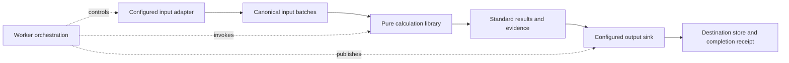

## Current R5 review authorization — October 7, 2026

The owner authorized separate local Codex reviewers for PR303 and all R5 stories. See [review policy](CODE_REVIEW.md). This supersedes earlier pending-authorization statements below without waiving completed final-head review or other acceptance gates. PR303 planning remains under qualification; no R5 worker implementation starts here.

## October 7 R5 parallel execution clarification

The owner authorized documenting bounded, dependency-aware parallel execution before R5 implementation. [Parallel execution plan](R5_PARALLEL_EXECUTION_PLAN.md) refines existing EQ-057/060/061/062/065/066; no new epic/release, numerical change or worker launch. Parquet locks whole write attempts per output root; DuckDB output has serialized ownership per database. Independent calculations require supplied inputs/initialization, ordered history and explicit universe barriers. Require input reuse, bounded backpressure, combined worker/backend resource budgets and measured 1/2/4/8-worker parity/scaling where capacity permits. Advanced acceleration remains R8.

BUG-005 is accepted in [actual release receipt](https://github.com/atulsrivas1/equity-features/issues/301#issuecomment-6041276187); use corrected Parquet0.1.0a1. Live EQ-057 is Ready; the other affected R5 stories remain Backlog. This clarification changes acceptance scope detail, not execution status. General R5 and this planning PR need an applicable separate-review policy before merge; previous bounded local authorization is not extended by inference. Older snapshots below retain their historical scope.

## EQ130 release audit under qualification

EQ121–129 are accepted; EQ130 is the sole active docs/audit story. [R4.1 audit](R4_1_ACCEPTANCE.md) and [exact R5 resume](R5_AUTONOMOUS_HANDOFF.md) bind actual accepted versions/heads/receipts, separate automated reviews, source/backend/composed evidence and preserved rights/limits. Final current head review/CI/artifact/publication/readback and canonical287Done precede epic/milestone closure and EQ057#65 Ready. R5 is prepared only; this chat stops before its implementation. No runtime/test/workflow/package/math/private execution change. Live Project/issue evidence is authority; earlier snapshots below preserve history.

# Calculation, I/O and worker architecture

Owner-directed decision, October 6, 2026; [GOV-014](https://github.com/atulsrivas1/equity-features/issues/275).
This document defines planned R4.1 scope. It does not claim repository creation,
adapter extraction, sink implementation, registry publication or worker delivery.
R4's accepted implementation and receipts remain valid historical evidence.

## Repository and dependency ownership

| Repository | Owns | Depends on |
| --- | --- | --- |
| `equity-features` | `equity-feature-contracts`, `equity-features`: canonical schemas, pure validation/discovery, supplied-data calculations | Numerical dependencies; no concrete I/O or worker packages |
| `equity-feature-io` (to create) | Independently installable I/O contracts, SDK, source adapters and output sinks | Canonical contracts; optional backend dependencies isolated per implementation |
| `equity-feature-workers` (to create) | Job manifests, CLI, scheduling, partitioning, retries/checkpoints, orchestration and catalog publication | Public calculation and I/O interfaces; implementations selected explicitly at startup |

The companion name is `equity-feature-io`, replacing the proposed adapter-only
repository name. Source and sink contracts are separate interfaces within that
repository, not separate repositories per direction/backend. Package name
availability and supported dependency versions are verified in EQ-121 before
publication. An I/O SDK may implement optional calculation examples without making
the I/O contracts distribution depend on calculation implementations or workers.

Keep the delivered dependency-light acquisition protocols and canonical schemas
in `equity-feature-contracts`. Do not move them merely to achieve a visual repository
split: that would break R3/R4 consumers or introduce circular dependencies. New
publication/factory interfaces belong in the companion I/O contracts distribution,
which depends inward on canonical contracts. It must not duplicate canonical
result/input schemas or move storage operations into the calculation library.

The worker selects required inputs, acquires bounded batches, passes supplied
facts/specifications to calculations, then passes standard results and a versioned
publication envelope to the sink. The sink owns conversion into its storage schema.
Workers do not contain backend-specific SQL, Parquet layouts or duplicate formulas.
The same components can be composed directly by a consumer without workers.

## Input boundary

Reuse [existing acquisition protocols](contracts/ADAPTERS.md) and
[adapter SDK](contracts/ADAPTER_KIT.md): explicit capabilities/request identity,
bounded batches, immutable source/mapping identities, units, UTC nanoseconds,
coverage and unknown availability. Source acquisition and canonical normalization
belong to the adapter. Validation does not establish source truth or rights.
Historical and optional live acquisition remain distinct; no new live capability
is implied. Unsupported requirements fail before a job claims success.

## Output boundary: EQ123 specification authority

The [EQ123 I/O v1 specification](IO_PUBLICATION_V1.md) now supplies the exact design and independent vectors through companion PR3; runtime implementation remains EQ125 and backend guarantees remain EQ126/127. Canonical280 records actual review/publication gates. The architecture outline below remains the scope boundary.

Publication accepts canonical results with values, nulls, quality/status, units,
evidence and input identities intact. The external envelope binds generation/job/
partition identity, contract/schema/algorithm/config versions, source snapshot and
mapping, cutoff/availability, and canonical content digest/counts. Operational
timestamps come from the caller/worker; do not invent historical known-at values.
Serialization and digest canonicalization must be specified before implementation;
logical-content identities must not depend on incidental Parquet byte layout.

The proposed lifecycle is begin -> bounded writes -> commit, with explicit abort
and status/receipt lookup for uncertain commit outcomes. Completion receipts bind
identity, content digest, counts, schema and opaque artifact references. A sink
must declare supported atomic visibility, transaction, retry, cancellation,
writer-concurrency and resource capabilities. Every result table/evidence component
is part of completeness; a values-only write cannot claim complete publication.

Same idempotency key and same logical content returns the committed receipt;
same key with different content is a conflict. The key includes destination scope
and versioned calculation/input/config identity. A correction uses a new generation,
with explicit supersession rather than silent overwrite. Exactly-once execution
across task claims and storage is not promised. A manifest-last protocol does not
make directory rename atomic on every storage platform. Require qualified readers
to ignore staged/uncommitted content, validate completion receipts and reject
corruption. Cancellation after commit cannot retract an accepted generation.

The sink owns storage transaction and retry-safe publication. Workers own task
claims, scheduling/retry decisions, resume checkpoints and accepted-generation
selection. An output completion receipt is not a task claim or catalog pointer.
EQ-057/061/063/064 reuse these types rather than creating a second sink protocol.
R9 evidence receipts link to these identities; publication receipts do not certify
the mathematical correctness or financial availability of supplied facts.

## Configuration and consumer extensions

Support both direct instance injection and explicitly populated, per-run source/
sink factory registries. Factories construct instances from validated configuration
and separately supplied credential providers. The worker resolves configuration at
startup and checks supported versions/capabilities before fetching or writing.
Registry IDs have separate source/sink namespaces; duplicate or unknown IDs fail.
No import-time plugin registration, hidden mutable global registry, credential
logging, or arbitrary module path from an untrusted request. Local extensions are
trusted caller code. Future remote services expose only server-approved components;
they never accept uploaded executables or untrusted serialized Python objects.

Consumers implement public protocols, install their own adapter/sink package,
run the conformance kit, and inject instances or register explicit factories. No
core modification is needed. Independently packaged synthetic examples must prove
this from installed artifacts, including typing and failure paths. Conformance
establishes contract compatibility, not durability, provider entitlements or
financial truth. Built-in calculations retain their own numerical qualification.

## First implementations and migration

R4.1 extracts the existing `equity-feature-duckdb` distribution with its current
import identity and qualified behavior. Preserve original-read mappings,
`binary64_exact`/half-even scale4 normalization, unknown availability, TBBO snapshot
sampling, UTC daily versus RTH distinctions and all accepted R4 limitations.
Preserve R4 receipts/history; qualify built packages with independent fixtures and
the supported version matrix before removing active source from this repository.
No deletion/rewrite of history, private lake cleanup or dataset migration is part
of this architecture story. Deprecation/version decisions are recorded in EQ-122.

Initial output sinks are immutable Parquet generations and transactional DuckDB.
The DuckDB source adapter is read-only; the sink takes an explicit output destination
and a declared serialized writer. Do not have multiple worker processes write a
shared database or silently modify the input store. Parquet publication declares
tested filesystem/process semantics and bounded resource behavior. PostgreSQL,
object storage and provider-specific outputs are possible custom/future sinks,
not promised R4.1 implementations. Provider adapters remain R6 scope.

## Release order and gates

Accepted R0–R4 -> **R4.1 repository separation and extensible I/O** -> R5 workers.
R5 implementation is blocked until all R4.1 acceptance gates are verified.
R6 provider/file adapters use the companion I/O repository; R7 services compose
workers/I/O without putting network access in calculations. Existing issue IDs,
milestones and delivery history are retained; cross-repository execution issues
must link the single authoritative planning record rather than duplicate status.

See [R4.1 story plans](R4_1_DELIVERY_PLAN.md), [backlog](BACKLOG.md) and live
[Project](https://github.com/users/atulsrivas1/projects/2). No release date is invented.
Separate final-head review, independent synthetic tests, clean installed artifacts,
compatibility, migration docs and actual publication verification are mandatory.
Real-source qualification remains a separate gate when source behavior changes;
synthetic round trips alone do not qualify private historical generation.
