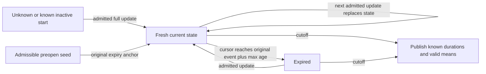

# Continuous quote time weights — experimental0.0.2a5

`equity_features.session.compute_time_weighted(batch, config, *, entity, seed=None)`
returns session.quote.time_weighted_spread. Parameters must be eligibility_policy,
max_age_ns exact integer1..int64max and initial_state (`seed`, `inactive`, `unknown`).
Continuous canonical quote sampling is required; snapshots reject. The supplied
scope is[open,C), positive duration fitting int64; quote events at C reject.
One entity/unit/basis/source/mapping and governed coverage/C/K/E remain caller supplied.

Every row is full current bid/ask, never a delta or silent carry for missing sides.
Invalid/crossed replace previous valid state; locked is valid0. Initial inactive
means known no quote (invalid time) until updated. Unknown initial time lasts until
the first admitted update; no backward fill. Each update, including equal-time
ordered updates, installs a new original expiry anchor. Earlier tied states have
zero time; the last governs positive duration. Freshness is[event,event+max_age).
Split at next update, original expiry or C. At exact expiry state is expired.
Wide Python expiry addition and clipped checked duration avoid int64 wrapping.

In seed mode, caller may supply a separate complete one-row continuous quote with
bid/ask explicitly present (null permitted), matching namespace/entity/unit/basis/
policy and source_id/mapping. Seed snapshot/input IDs are separately bound; input ID
must differ from target and seed event ID cannot duplicate target. Event must lie
inside supplied preopen scope ending<=open. Row at open belongs in target, not seed.
Original seed timestamp anchors expiry, never reset at open. Unavailable or absent
seed contributes unknown initial time and exclusion/absence reason; no future state
is consumed. A target update at open can leave zero unknown duration independently.
Extraneous seed in inactive/unknown mode rejects. Nothing is fetched.

`QuoteDurations(normal,locked,crossed,invalid,expired,unknown)` has exact int64
categories, total=C-open, valid=normal+locked and derived valid_fraction.
`TimeWeightedSpread(durations,mean_spread,mean_bps,max_age_ns,initial_state)` is an
immutable typed result. Valid-only mean spread uses checked decimal128 sum of
(ask-bid)*dt divided by(valid_ns*10^scale). Bps uses individually exact wide
fractions 20000*(ask-bid)/(ask+bid) before compensated float64 sum(z*dt)/valid_ns.
No ratio of mean prices, tick midpoint rounding or abs(crossed spread). Tolerances
rtol/atol1e-12 in stated units; all durations compare exactly.

Complete initialized input with positive valid time is available even when known
crossed/invalid/expired time exists. Zero valid time gives null means/not_applicable
with typed known duration diagnostics. Complete source with unknown left time gives
null means/incomplete_coverage and typed durations. Missing input gives null cell/
missing_input. Incomplete delivery gives null cell/incomplete_coverage: unspecified
feed-gap locations cannot certify carried category durations. Expiry is freshness,
never delivery proof. Known feed outage must be declared incomplete or normalized
into verified no-quote states where that is what happened.

Schema1 envelopes now carry time_weighted_spread dtype. Prior provisional scalar
registry outputs migrate into one typed cell: *_duration_ns maps to durations.*,
valid duration/fraction are derived fields and means retain their original units.
Unknown duration remains explicit. Arrow copies nested typed duration structs;
duration ns are int64 intervals, not UTC timestamps. Root target/seed bindings and
config digest distinguish source/initialization/age choices. At most one consumed
or excluded seed EvidenceRow; target integration keeps no growing row evidence.
Quality expected/observed is raw target delivery count, not duration denominator.

Reducer retention is six counters, checked numerator/compensated pair, integration
cursor and one current quote/anchor. Batch canonical ownership/validation and
Arrow copies remain input proportional. Batch capability only; no update/restore/
merge or measured throughput claim. [Example](../../examples/continuous_quotes.py).
