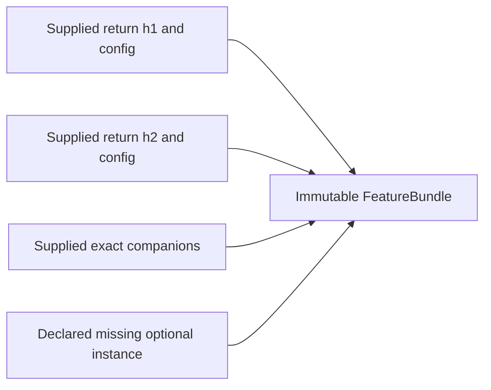

# Supplied feature composition

EQ037 experimental pair0.0.3a12, new collection schema1. Existing input, result,
state schemas, numerical formulas and the39-feature inventory remain unchanged.
Composition preserves already supplied results; it executes no dependency or I/O.
[Pre-code plan](../stories/EQ-036_PLAN.md),
[synthetic example](../../examples/feature_composition.py).

## Owned components

`FamilyResult(instance_id, result, config, context=None, companion=None)` owns one
whole immutable FeatureResult and its actual ConfigSpec. Instance IDs distinguish
the same feature at different horizons/buckets; feature ID alone is not a join key.
Available and unavailable supplied families both remain intact, including quality,
null values and bounded original evidence. Config digest, v1 algorithm, actual
delivered output dtype/unit and producer backend/evidence conventions are checked.
History price units carry the configured currency; breadth counts use members and
above-SMA uses fraction. Discovery descriptions do not convert supplied values.
EQ037 corrects discovery to the existing producer representation: prior extrema
are Float64 prices, direction counts use members, and above-SMA uses fraction.
Composition now reads those registry descriptors directly. Currency/share remains
a symbolic configured unit, including USD/share or EUR/share. Structured coverage
fields retain their separate typed semantics; numerical schemas are unchanged.

Context is HistoryContext or BucketContext. Historical and baseline producers must
retain their consumed exact context binding even when the market batch is missing.
Direct producer context entity, full target, governed grid and digest must match.
Optional downstream consumers retain the dependencies they actually consumed;
composition does not invent a context for an absent dependency.

Companion is SMAReference, VolumeBaseline, IntervalBaseline, ReturnReference or
BreadthResult. Its result must match the component; its owned config/context must
also match where present. SMA witnesses are checked through SMAInput. Exact
sum/count witnesses and breadth exclusions remain supplied, not reconstructed.
If a caller supplies only a plain result, composition does not manufacture a
missing witness. A baseline and its consuming ratio can be separate instances.

## Collection and compatibility

`CompositionSpec(namespace, session, availability, instance_ids, mode="batch")`
declares the complete ordered instance population and one full target/C-K-E.
`compose_features(components, *, spec)` returns FeatureBundle with components in
declared order and missing_instances in declared order. Duplicate/extra IDs,
conflicting target/timing, unsupported modes and stale backend versions reject.
No common config, window, input unit or action snapshot is fabricated: different
valid instance scopes remain explicit, and no cross-unit arithmetic is performed.

All three session.quote IDs use the existing python-exact-compensated backend;
other delivered kernels use python-exact. Sampled quote evidence uses its actual
observation_limit, continuous output has fixed bound1, and other producer bounds
are configured evidence_limit/default0. Qualified version must equal the current
features package version. This collection has no update/merge/restore operation.

Shared input IDs require identical kind/metadata. Direct daily_history frames own
one context instrument; bucket_history owns one instrument/normalized bucket.
Direct session market frames also retain their declared instrument population, including bars/trades/quotes/seeds/prior-close inputs. Conflicting populations for one frame reject even with evidence_limit0; coherent same-instrument reuse across sampled and continuous quote features remains valid. Shared original row IDs
must agree on event/known-at; derived use, interval and output entity may differ
legitimately by feature and remain in their original component. This is structural
consistency, not source authentication; absent retained proof cannot be recreated.

FeatureBundle's identity_digest binds the entire spec, ordered supplied results,
actual configs/contexts/companions and explicit missing list. It is a deterministic
identity, not a provenance signature. Collections are immutable owned tuples.

## Verification and limits

Production fixtures cover independent h1=1/10/h2=21/100, ordering/missing families,
unavailable results, exact SMA and partial breadth companions, separate buckets,
source revisions/contradictory original proof, derived-proof differences, mandatory
context with missing source, fixed output schema, direct ownership with zero
evidence, actual quote conventions and independent currency scopes. No numerical
speed, source/provider rights, stable publication or hidden replay claim.

Instrument population claims must agree for shared original normalized frames. Bucket scope is an additional explicit bucket_history claim and conflicts only with another explicit bucket claim; native session bars can reuse the same instrument/frame without declaring historical bucket scope. Missing prior history remains an unavailable supplied component, not a false identity error.
